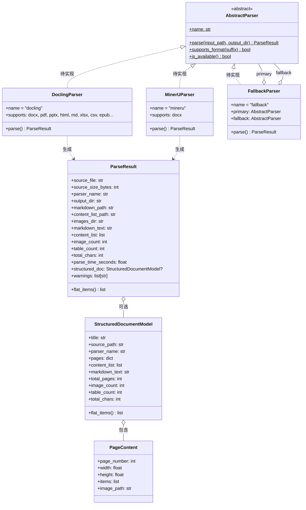
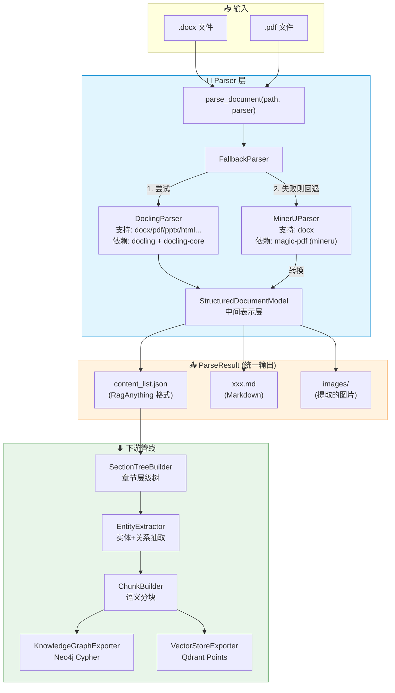
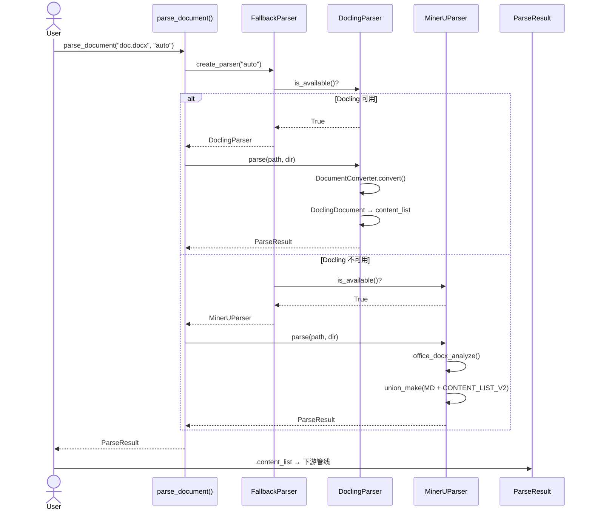

# Parser 模块分析

## 1. 公开入口

| 入口 | 来源 | 状态 |
|------|------|------|
| `parse_document()` | `parser/__init__.py` → `parser.fallback` | ❌ `fallback.py` 不存在 |
| `create_parser()` | 同上 | ❌ |
| `AbstractParser` | `parser/base.py` | ✅ 可用 |
| `ParseResult` | `parser/models.py` | ✅ 可用 |
| `StructuredDocumentModel` | `parser/models.py` | ✅ 可用 |
| `main.py::parse_docx()` | `main.py`（独立） | ✅ 但未纳入 parser 包 |

## 2. 核心类

| 类 | 文件 | 职责 | 状态 |
|----|------|------|------|
| `AbstractParser` | `base.py` | 抽象接口，定义 `parse()` / `supports_format()` / `is_available()` | ✅ |
| `ParseResult` | `models.py` | 统一解析输出，兼容现有管线 | ✅ |
| `StructuredDocumentModel` | `models.py` | 中间文档表示（独立于后端） | ✅ |
| `PageContent` | `models.py` | 单页内容容器 | ✅ |
| `DoclingParser` | — | Docling 后端实现 | ❌ 未创建 |
| `MinerUParser` | — | MinerU 后端实现 | ❌ 未创建 |
| `FallbackParser` | — | 主/备切换逻辑 | ❌ 未创建 |
| `main.py::parse_docx()` | `main.py` | 现有 MinerU 解析器（独立函数） | ✅ 孤立存在 |

## 3. 类关系图（Mermaid）



## 4. 调用链

### 当前设计（目标状态）

```
用户调用
  │
  ▼
parse_document("file.docx", parser="auto")   ← parser/__init__.py
  │
  ▼
create_parser("auto")                         ← parser/fallback.py (❌ 未创建)
  │
  ├─ 1. 尝试 DoclingParser.is_available()
  │     └─ 可用 → 返回 DoclingParser()
  │
  └─ 2. 回退 MinerUParser
        └─ 返回 MinerUParser()
  │
  ▼
parser.parse(input_path, output_dir)
  │
  ├─ Docling: DocumentConverter → DoclingDocument
  │     └─ 转换 → content_list (RagAnything 格式)
  │     └─ 提取 → markdown_text
  │     └─ 保存 → images
  │
  └─ MinerU: office_docx_analyze → middle_json
        └─ union_make → markdown + content_list
        └─ 保存 → images
  │
  ▼
ParseResult
  ├── .content_list      → 输入到 SectionTree
  ├── .markdown_text      → 参考文本
  ├── .content_list_path  → 路径引用
  └── .structured_doc     → 中间模型（Docling 专有）
```

### 现有主流程（main.py 独立）

```
python main.py <input.docx>
  │
  ▼
main() → parse_docx(input_path, output_dir)
  │
  ├─ mineru.backend.office.docx_analyze.office_docx_analyze()
  │     └─ 输出: middle_json + 图片提取
  │
  ├─ mineru...union_make(pdf_info, MM_MD)
  │     └─ 输出: markdown (带行内图片 + HTML 表格)
  │
  ├─ mineru...union_make(pdf_info, CONTENT_LIST_V2)
  │     └─ 输出: content_list (RagAnything 格式)
  │
  └─ 返回 ParseResult (旧版 mineru-only)
```

## 5. 输入数据结构

### `AbstractParser.parse()` 输入

```
input_path:  str | Path    # .docx / .pdf / .pptx ...
output_dir:  str | None    # 输出目录，None 时自动生成
```

### `content_list` 格式（RagAnything 兼容）

```python
# 页面包裹格式: [[page0_items], [page1_items], ...]
[
    [  # Page 0
        {
            "type": "image",
            "content": {
                "image_source": {"path": "output/images/xxx.png"}
            }
        },
        {
            "type": "paragraph",
            "content": {
                "paragraph_content": [
                    {"type": "text", "content": "PA2A 中央集控器"}
                ]
            }
        },
        {
            "type": "title",
            "content": {
                "level": 1,
                "title_content": [
                    {"type": "text", "content": "1 概述"}
                ]
            }
        },
        {
            "type": "table",
            "content": {
                "html": "<table>...</table>"
            }
        },
        {
            "type": "list",
            "content": {
                "list_items": [
                    {"item_content": [{"type": "text", "content": "条目1"}]}
                ]
            }
        }
    ]
]
```

**Item 类型枚举：** `image` | `paragraph` | `title` | `table` | `list`

## 6. 输出数据结构

### `ParseResult` (统一输出)

```python
@dataclass
class ParseResult:
    # === 标识 ===
    source_file: str              # 输入文件绝对路径
    source_size_bytes: int        # 输入文件大小
    parser_name: str              # "docling" | "mineru" | "fallback"

    # === 文件路径 ===
    output_dir: str               # 输出根目录
    markdown_path: str            # .md 文件路径
    content_list_path: str        # content_list.json 路径
    images_dir: str               # 图片目录

    # === 内容 ===
    markdown_text: str            # 完整 Markdown 文本
    content_list: list            # RagAnything 格式 (页面包裹的二维列表)

    # === 统计 ===
    image_count: int = 0
    table_count: int = 0
    total_chars: int = 0
    parse_time_seconds: float = 0.0

    # === 扩展 ===
    structured_doc: StructuredDocumentModel | None = None  # Docling 专有
    warnings: list[str] = []      # 非致命警告

    # === 计算属性 ===
    @property
    def flat_items(self) -> list[dict]  # 展开页面包裹，返回一维列表
```

### 下游消费

```
ParseResult.content_list  →  SectionTreeBuilder.build()
ParseResult.flat_items    →  EntityExtractor.extract()
ParseResult.markdown_text →  ChunkBuilder.build()
ParseResult.images_dir    →  ChunkBuilder (图片储存)
```

## 7. 模块在系统中的定位

```
┌──────────────────────────────────────────────────────────┐
│                     BCM-RAG 系统分层                       │
├──────────────────────────────────────────────────────────┤
│                                                          │
│  [1] PARSER 层  ← 你在这里                              │
│      Raw .docx/.pdf                                      │
│        ↓                                                 │
│      ParseResult (content_list + markdown + images)      │
│                                                          │
│  [2] CONTENT ANALYSIS 层                                 │
│      content_list                                         │
│        ↓                                                 │
│      SectionTree → Entities → Chunks → KG/Vectors        │
│                                                          │
│  [3] RETRIEVAL 层 (缺失)                                 │
│      Query → Graph → Vector → Rerank → Compress → LLM   │
│                                                          │
│  [4] API 层 (缺失)                                       │
│      FastAPI REST endpoints                              │
│                                                          │
└──────────────────────────────────────────────────────────┘
```

Parser 是系统入口层，职责：

- **解耦文件格式**：上层代码只关心 `content_list`，不关心来源是 Docling 还是 MinerU
- **多后端容错**：主解析器失败时自动降级
- **统一输出**：无论哪个后端，产出相同格式
- **中间模型**：`StructuredDocumentModel` 独立于 RagAnything 格式，避免供应商锁定

## 8. 完整架构 Mermaid 图





## 9. 当前问题清单

| 问题 | 严重度 | 说明 |
|------|--------|------|
| `fallback.py` 缺失 | 🔴 致命 | `__init__.py` 导入失败，整个包不可用 |
| `DoclingParser` 缺失 | 🔴 致命 | 没有具体实现 |
| `MinerUParser` 缺失 | 🔴 致命 | main.py 逻辑未迁移 |
| `main.py` 孤立 | 🟡 中 | 与 parser 包并存但无关联 |
| 两套 `ParseResult` | 🟡 中 | `parser/models.py` 和 `main.py` 各有一个 |
| `_CHAPTER_TO_MODULE` 硬编码 | 🟢 低 | 仅适配一份特定 BCM 文档 |

## 10. 建议下一步

1. **创建 `fallback.py`** — 实现 `create_parser()` 和 `parse_document()`，自动检测可用后端
2. **创建 `docling_parser.py`** — DoclingDocument → content_list 转换器
3. **重构 `main.py`** — 将其 MinerU 逻辑迁移为 `mineru_parser.py`
4. **统一 ParseResult** — 删除 main.py 中的旧版，全部用 parser 包的版本
5. **更新 CLI** — main.py 改为 parser 包的前端入口
